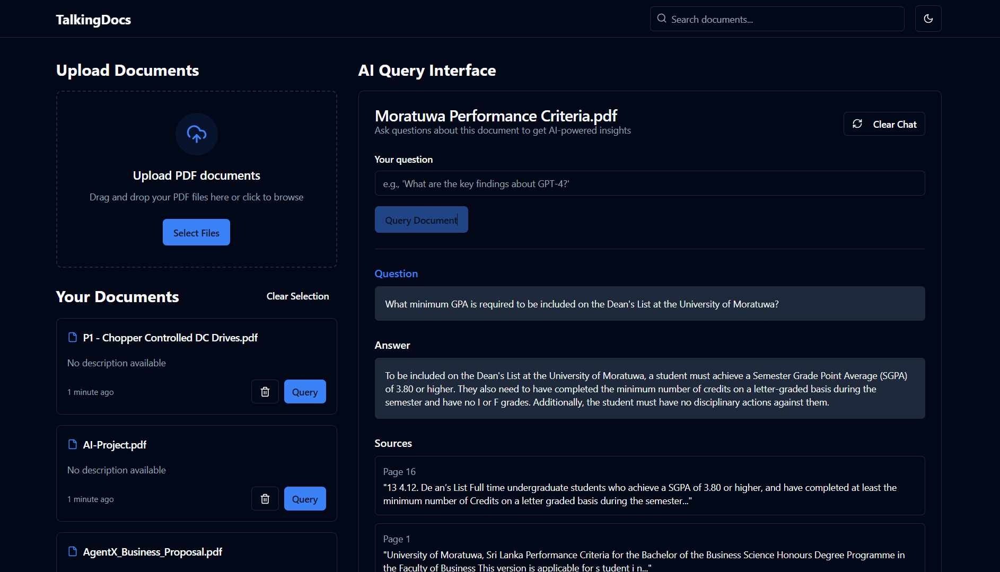
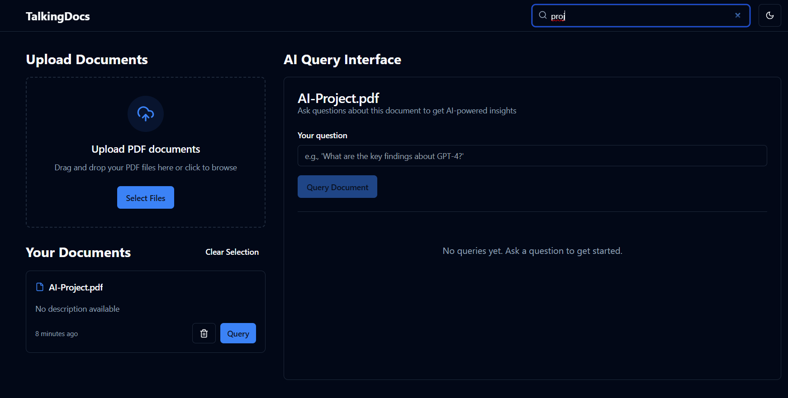

# TalkingDocs - AI Document Reader


https://github.com/user-attachments/assets/bd9cd6f5-9142-44be-bb98-aa68c44f85eb


----------



------
------------



## Overview

TalkingDocs is a RAG-powered AI document reader that allows you to:
- Upload PDF documents
- Ask questions about your documents
- Get AI-generated answers with source references
- Analyze document content efficiently

## Features

- PDF text extraction and processing
- AI-powered question answering using Google Gemini model
- RAG (Retrieval-Augmented Generation) for better context awareness
- Source attribution for answers
- Simple and intuitive user interface

## Setup Instructions

### Frontend Setup

1. Clone the repository
```sh
git clone https://github.com/kugesan1105/TalkingDocs.git
cd TalkingDocs
```

2. Install frontend dependencies
```sh
cd front_end
npm install
```

3. Start the frontend development server
```sh
npm run dev
```

### Backend Setup

1. Navigate to the backend directory
```sh
cd backend
```

2. Install backend dependencies
```sh
pip install -r requirements.txt
```

3. Set up your Google API key
```sh
export GOOGLE_API_KEY="your-google-api-key-here"
```

4. Start the backend server
```sh
uvicorn main:app --reload
```

## Requirements

### Frontend
- Node.js
- npm
- Vite
- React

### Backend
- Python 3.8+
- Google Gemini API key (obtain from [Google AI Studio](https://ai.google.dev/))

## API Endpoints

- `POST /query` - Submit a document and query to get AI-generated answers

## Development

This project uses:
- Vite, TypeScript, and React for the frontend
- FastAPI and LangChain for the backend
- Gemini models from Google for AI capabilities

## Deployment

Future plans include deploying the application on cloud platforms.

## License

[MIT License](LICENSE)
